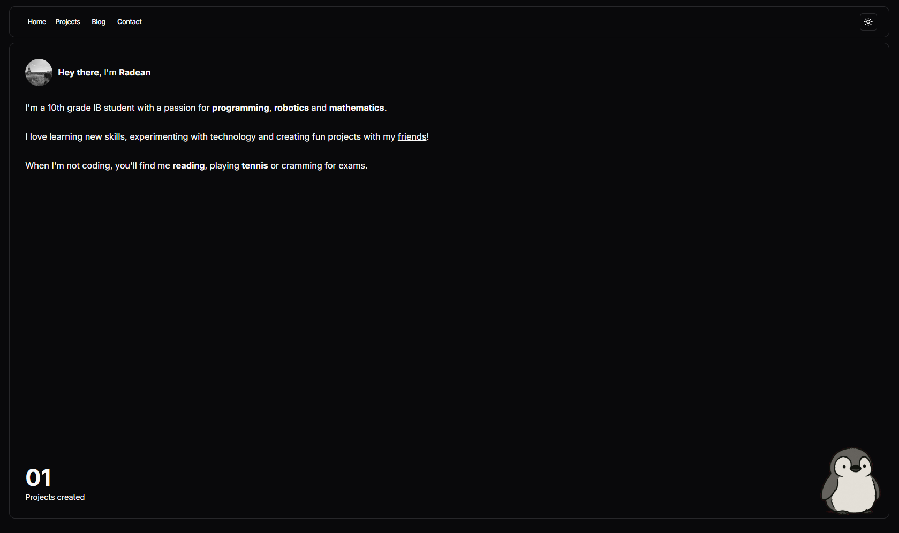

# Deanportfolio

Deanportfolio is a personal portfolio website introducing me, my projects and thoughts to others!

Built with Next, Tailwind and Drizzle, this uses PostHog for analytics, NextAuth for admin panel verification and is deployed on Vercel!

It features:
 - Custom admin panel and markdown editor for creating new projects and posts
 - Dark/light mode toggling
 - Detailed user analytics
 - Penguin animations 🐧

In the future, I hope to add:
 - [ ] Editing functionality to the admin panel
 - [ ] Better SEO through a custom domain
 - [ ] Performance optimizations, particularly through smarter caching